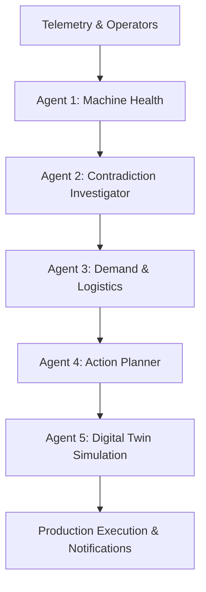

# FactoryMind AI — Autonomous Multi-Agent Smart Factory Orchestrator

FactoryMind AI is a next-generation, industrial-grade multi-agent orchestration platform designed for autonomous smart factory operations, real-time telemetry diagnostics, cognitive contradiction resolution, and closed-loop digital twin simulations. 

The platform bridges the gap between raw hardware telemetry and high-level human operational planning, allowing factories to automatically detect anomalies, resolve reporting discrepancies, forecast logistics impacts, and dry-run physical mitigation procedures before dispatching them to the shop floor.

---

## 🏗️ Multi-Agent Orchestration Architecture

The system features an autonomous five-agent pipeline that processes telemetry and operator input sequentially, passing structured state representations down the chain to build a comprehensive recovery plan.



### 1. Agent 1: Machine Health Diagnostics Agent (Predictive Telemetry)
* **Function**: Evaluates raw multi-sensor telemetry streams (rotational speed, torque, tool wear, air temperature, and process temperature).
* **Role**: Runs real-time vector analysis to calculate anomalous deviations, estimate failure probability indexes, and isolate specific hardware components (e.g. tool spindle, coolant pump) showing warning signatures.

### 2. Agent 2: Contextual Contradiction Investigator (Cognitive Alignment)
* **Function**: Cross-references structured sensor data with unstructured operator shift notes, supplier emails, and news feeds.
* **Role**: Detects semantic and cognitive contradictions (e.g. an operator logging "Machine 1 is operating nominally" while sensors indicate imminent overstrain). It resolves conflicts by prioritizing physical telemetry and adjusting confidence weights accordingly.

### 3. Agent 3: Operational Demand & Logistics Forecast Agent (Supply-Chain Alignment)
* **Function**: Matches predicted machine downtime windows against production queue logs, product shipment deadlines, and spare parts inventory.
* **Role**: Projects the financial and logistics impact of potential machine outages, alerting operations managers if critical order batches (e.g. high-priority production runs) are threatened by supply chain delays.

### 4. Agent 4: Autonomous Action Planner (Mitigation Orchestration)
* **Function**: Generates physical recovery procedures to mitigate detected risks.
* **Role**: Synthesizes the findings of the previous agents into a step-by-step action plan (such as cooling loop cleanups, torque limits, or tool replacements). Each action includes a priority rating, estimated downtime duration, and execution cost estimation.

### 5. Agent 5: Digital Twin Simulation Agent (Closed-Loop Twin Validation)
* **Function**: Dry-runs the proposed action plans on a simulated software representation (digital twin) of the factory equipment.
* **Role**: Evaluates the post-recovery states of the machines, verifying that the risk index drops and Overall Equipment Effectiveness (OEE) metrics recover. Upon successful validation, it triggers closed-loop alerts and notifications (e.g. Email or SMS) to dispatch teams.

---

## 🛠️ Technology Stack

### Frontend (SmartFactory Control Panel)
* **Core**: React 19, TypeScript, Vite
* **Styling**: Vanilla CSS (Tailwind-compatible Custom Design System)
* **Icons & Parsing**: Lucide React, PapaParse (for CSV ingestion stream parsing)
* **Deployment**: Vercel

### Backend (Intelligent Gateway)
* **Core**: FastAPI (Python 3.11+), Pydantic
* **Orchestration**: LangChain, OpenAI / Anthropic API wrappers
* **Database & Persistence**: Supabase (PostgreSQL)
* **Deployment**: Render

---

## 🚀 Getting Started

### Prerequisites
* **Node.js** (v22.0.0 or higher)
* **Python** (v3.11 or higher)
* **Supabase** account and project configurations

### Environment Configuration

1. Create a `.env` file in `smartfactory-ai/backend/` containing:
   ```env
   SUPABASE_URL=your_supabase_url
   SUPABASE_KEY=your_supabase_anon_or_service_key
   OPENAI_API_KEY=your_openai_api_key
   ```
2. Create a `.env.local` file in `smartfactory-ai/web/` containing:
   ```env
   VITE_API_BASE=https://your-backend-api.onrender.com/api/v1
   ```

### Installation

#### 1. Frontend Setup
```bash
cd smartfactory-ai/web
npm install
npm run dev
```

#### 2. Backend Setup
```bash
cd smartfactory-ai/backend
python -m venv venv
source venv/bin/activate  # On Windows use: venv\Scripts\activate
pip install -r requirements.txt
uvicorn main:app --reload --port 8000
```

---

## 📦 Production Builds & Deployment

### Building Frontend
To build the compiled, optimized client environment assets:
```bash
cd smartfactory-ai/web
npm run build
```
The static files are output to `smartfactory-ai/web/dist` ready to be served by Vercel.

### Deploying Backend
The backend can be deployed to Render using a Python Web Service template running the start command:
```bash
uvicorn main:app --host 0.0.0.0 --port $PORT
```
